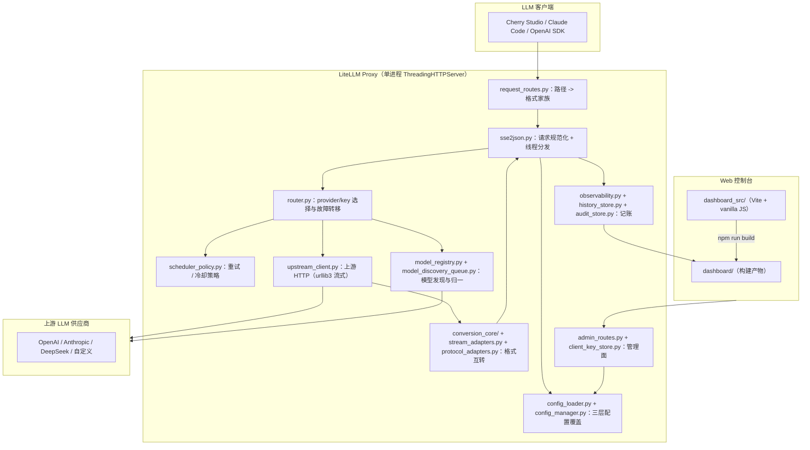

# LiteLLM Proxy 架构全景 (Architecture Overview)

> **定位**：这是**克制版**架构文档，只写"看代码看不出来"的东西——系统全景、模块边界与依赖纪律、核心数据链路、已知取舍。
> 逐模块、逐文件的深度讲解见 [docs/PROJECT_OVERVIEW.md](docs/PROJECT_OVERVIEW.md)；对外功能与快速开始见 [README.md](README.md)。

---

## 1. 系统全景架构



## 2. 模块划分与依赖边界

- **HTTP / 入口层** — `sse2json.py`：代理唯一进程入口（`ThreadingHTTPServer` + `ThreadingMixIn`，`server.max_workers` 默认 20），负责路径分类后的流式/非流式处理与后台任务（健康检查、状态保存等）。`request_routes.py`：把路径归入 `chat / responses / anthropic / dashboard / admin / shared` 家族。`request_dispatcher.py`：请求调度辅助。
- **路由决策层** — `router.py`（候选频取、冷却、失败上报）、`scheduler_policy.py`（错误类型 → cooldown 范围/时长）、`model_registry.py`（canonical/raw 命名与发现）。
  **该层不接触客户端 IO，也不直接发起上游请求**——只产出"下一个尝试"候选（Attempt）。
- **上游 IO 层** — `upstream_client.py`：唯一被允许直接连接上游的模块。
- **格式转换层** — `conversion_core/`（新一代转换引擎，codecs 按 chat / responses / anthropic 分文件）、`stream_adapters.py`（SSE 流式转换 + 直通中继）、`protocol_adapters.py`（非流式转换）、`format_adapters.py`（格式配对分派）、`chat.py` / `responses.py`（各格式非流式处理器）。
- **配置层** — `config_loader.py`（加载/归一/推断/环境变量覆盖/零配置检测）、`config_manager.py`（运行时 overlay + tombstone 合并）。优先级：`config.json → runtime_config.json → env`。
- **可观测层** — `observability.py`（内存指标/健康分）、`history_store.py`（SQLite 请求历史，默认保留 30 天并定时剪枝）、`audit_store.py`（JSONL 审计）、`usage_accounting.py` / `usage_statistics.py` / `pricing_resolver.py`（用量与成本）。
- **管理面** — `admin_routes.py`（Admin API 分发）、`routing_explain.py` / `routing_trace.py`（路由可解释性）、`proxy_utils.py`（密钥掩码/IP 解析）、`client_key_store.py`（客户端虚拟密钥：存储/鉴权/限流/配额）。
- **前端** — `dashboard/`（构建产物，代理直接伺服）、`dashboard_src/`（Vite + vanilla JS 源；`npm run build` 产物写入 `dashboard/`）。
- **打包子包** — `conversion_core/`、`artificial_analysis_api/`（pyproject `packages.find` 仅包含这两个包）；`artificial_analysis_api/` 负责 artificialanalysis.ai 基准定价数据抓取与缓存。

**依赖纪律（防跨层违规）**：
1. 请求处理代码**禁止直接读写全局运行时对象**（`RUNTIME` / `CONFIG` / `ROUTER` …），只能通过 `_request_runtime()` 获取的不可变 `RuntimeContext` 快照访问——防止配置热更撕裂。
2. 运行时配置的读写只能经 `RuntimeConfigManager._locked_overlay()`（`RLock` 上下文）进行原子读改写。
3. 管理端写操作落到 overlay（`runtime_config.json`），**永不改写 `config.json`**。
4. 前端数据唯一来源是 Admin API；上游请求与数据库只发生在代理后端。

## 3. 关键数据流向

### 3.1 一次客户端请求
```
POST /v1/chat/completions 或 /v1/responses 或 /anthropic/v1/messages
  → request_routes.classify_*()                 路径 → 格式家族
  → sse2json 规范化请求体 + RuntimeContext 快照
  → router.iter_attempts()                      产出候选（provider + key + url + format）
  → upstream_client 发起请求
  → 同格式直通；跨格式由 conversion_core / stream_adapters / protocol_adapters 转换
  → 写回客户端（SSE 开始后不再透明重试）
  → observability 记账（request history、attempt 追踪、usage/cost、audit）
```
失败语义：仅在向客户端写响应前可重试；一旦开始输出 SSE，上游断流错误直接透传。

### 3.2 配置热更
Dashboard / Admin 写入 → `config_manager` 合并 overlay（tombstone = `null` 表示删除基配置条目）→ 下一个请求的 `RuntimeContext` 快照即生效，无需重启。

### 3.3 模型发现
provider/keys/format 变更或后台触发 → `model_discovery_queue` → 拉取各 provider `/v1/models` → `model_registry` 归一为 canonical 模型表；发现失败时保留 last-known 模型，不静默清空。聚合供应商的厂商副本（`sail/...`、`runware/...` 同一基础模型）归一为单一 canonical 并记录 1 对多 `variant_map`：任一副本未被禁用 canonical 即对 `/v1/models` 可见，路由按副本顺序故障转移。

### 3.3.1 后台网络让路（QoS）
即时请求永远优先：有真实请求在途、或最后一个请求结束后 `background.quiet_window_s` 秒内，后台网络任务（模型发现、AA 价格抓取、启动 AA 预取）自动推迟并按短间隔重试，网络空闲后才执行（健康探测另有 in_flight 避让与代数熔断）。手动触发的操作（刷新模型、测试按钮）走紧急通道不受窗口限制；被连续推迟超过 `background.max_defer_s` 的任务会执行一次防饿死。即时请求处理路径本身无任何同步网络操作。

### 3.4 健康探测与自动路由
自适应空闲健康检查（频率 30s~6h） + 巡逻扫描 → `observability` 健康分 → `router` 在 `auto` 模式下按健康分动态调整 provider 优先级（`provider_select` 共 5 种模式：`priority_failover` / `round_robin` / `weighted_rr` / `random` / `auto`）。

## 4. 核心抽象与设计模式

- **RuntimeContext 不可变快照** — 请求级访问全局状态一律先取快照，避免热更撕裂。
- **Attempt 候选迭代** — `router.iter_attempts()` 惰性产出候选；`scheduler_policy.RetryDecision` 决定是否继续尝试与冷却范围。
- **Tombstone 覆盖层** — overlay 中 `null` 值表示"删除基配置条目"；基配置条目移除后自动剪除不再需要的 tombstone。
- **流式适配器契约** — 所有 stream 转换器/中继在客户端断开时优雅收尾并返回 `None`（失败信号），禁止抛二重异常。
- **密钥掩码 + 计时安全鉴权** — 全链路掩码输出；Admin 鉴权用 `hmac.compare_digest`。

## 5. 外部依赖与集成点

- **上游 LLM 供应商**：OpenAI / Anthropic / DeepSeek 及自定义供应商（运行期配置；每条 provider 可声明任一种格式）。
- **Artificial Analysis 基准数据**：`artificial_analysis_api/` 从 artificialanalysis.ai 抓取模型速度/定价/智能评分（带缓存与内置索引），用于费用估算和控制台模型详情抽屉。
- **SQLite**：仅本地请求历史（`data/`），默认保留 30 天。
- **容器化**：`Dockerfile`（`python:3.12-slim`，`EXPOSE 4894`）、`docker-compose.yml`（绑定 `127.0.0.1:4894` + healthcheck）、`deploy/nginx` 与 `deploy/systemd` 反向代理/裸机样例。

## 6. 技术债务与已知取舍

- **版本管理**：`pyproject.toml` 声明版本 `1.0.0`，但仓库尚无 git tag，发版流程待建立（见 CHANGELOG.md 顶部说明）。
- **并发模型**：单进程多线程（`max_workers` 默认 20）承担全部请求与后台任务；流式长连接长期占用线程，高并发流式需调大 `max_workers` 或进程化。
- **历史持久化**：SQLite 单文件、默认 30 天保留；长期留存依赖剪枝机制，暂无分库/分表方案。
- **控制台产物未压缩**：`vite.config.js` 显式 `minify: false`——32 个 Node UI 测试直接断言源码/产物的正则子串；改动关键类名/结构须同步跑 `npm test`。
- **文档漂移风险**：历史文档中测试数出现过 459 / 821 两个过期值；约定以 `python -m pytest tests/ --collect-only` 实测数为准（当前 886 个 / 51 文件）。
- **多线程共享状态**：热重载期间必须经快照或 RLock 访问共享状态；历史上曾修复 readline-of-closed-file、字典迭代中修改等竞态（2026-06~07 修复并测试固化）。

---

## 相关文档

- 深度架构讲解：`docs/PROJECT_OVERVIEW.md`
- 对外 API 与管理 API 规范：`docs/API_REFERENCE.md`
- 模型路由生命周期：`docs/MODEL_ROUTING_LIFECYCLE.md`
- 故障排查：`docs/TROUBLESHOOTING.md`
- 版本历史：`CHANGELOG.md`
- AI 协作规范：`AGENTS.md`（仅本地，不随仓库提交）