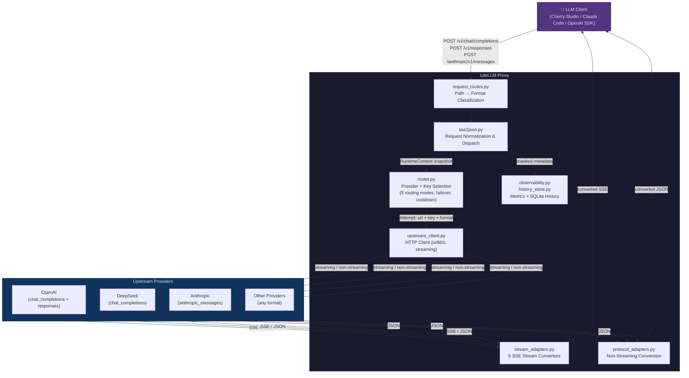
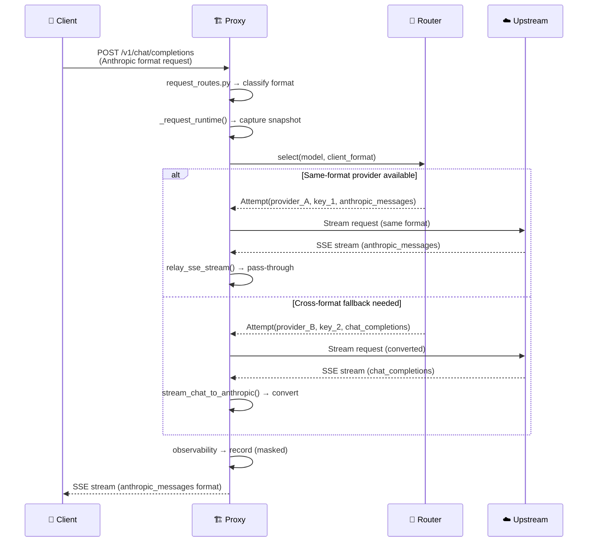

<div align="center">

# 🚀 LiteLLM Proxy

### Format-Aware LLM API Proxy · Smart Routing · Web Dashboard

[](https://opensource.org/licenses/MIT)
[](https://www.python.org/downloads/)
[](https://github.com/XD06/litellm-proxy/actions/workflows/ci.yml)
[](https://hub.docker.com/r/dsk3/litellm-proxy)
[](https://github.com/XD06/litellm-proxy/actions/workflows/ci.yml)
[](https://github.com/XD06/litellm-proxy/pulls)

[]()
[]()
[]()
[](https://github.com/XD06/litellm-proxy)
[](https://github.com/XD06/litellm-proxy)

**English** · [中文](README_CN.md) · [Architecture](PROJECT_OVERVIEW.md) · [Contributing](CONTRIBUTING.md)

</div>

---

> A Python-based **format-aware LLM API proxy** that sits between LLM clients (Cherry Studio, Claude Code, OpenAI SDK, etc.) and multiple upstream LLM providers. It accepts three API formats — **OpenAI Chat Completions**, **OpenAI Responses**, and **Anthropic Messages** — and can convert between any pair when the best available provider uses a different format than the client requested.

<table>
  <tr>
    <td width="50%" align="center"></td>
    <td width="50%" align="center"></td>
  </tr>
  <tr>
    <td width="50%" align="center"></td>
    <td width="50%" align="center"></td>
  </tr>
</table>

---

## 📑 Table of Contents

- [✨ Features](#-features)
- [⚡ Quick Start](#-quick-start)
- [🐳 Docker / VPS](#-docker--vps)
- [📊 Dashboard](#-dashboard)
- [🏗️ Architecture](#-architecture)
- [🔌 Client Endpoints](#-client-endpoints)
- [⚙️ Configuration](#-configuration)
- [🗺️ Project Map](#-project-map)
- [🛠️ Development](#-development)
- [🔒 Security](#-security)
- [🤝 Contributing](#-contributing)
- [📄 License](#-license)

---

## ✨ Features

| Icon | Feature | Description |
|:---:|---|---|
| 🔄 | **Three-Format Conversion** | Bidirectional conversion between `chat_completions` ↔ `responses` ↔ `anthropic_messages`, including streaming SSE with text, reasoning/thinking blocks, and tool calls |
| 🧠 | **Smart Routing** | 5 routing modes: priority failover, round-robin, weighted rotation, random, and **auto mode** with real-time health-score-based priority adjustment |
| 🛡️ | **Failover & Cooldown** | Per-key and per-provider cooldown, retry policies, candidate de-duplication — resilient by design |
| 📈 | **Observability** | SQLite-persisted request history, per-attempt latency attribution, routing explainability, token/cost estimation |
| 🖥️ | **Web Dashboard** | Provider health cards with latency charts, request traces, routing config, model mapping, built-in Playground, audit logs |
| ⚡ | **Runtime Config** | Three-layer overlay (`config.json → runtime_config.json → env vars`) with tombstone-based deletion; all mutations `RLock`-serialized |
| 🔒 | **Concurrency Safety** | `RuntimeContext` snapshots ensure consistent state during hot-swaps; stream adapters handle client disconnections gracefully |
| 🐳 | **Docker Ready** | One-command `docker compose up` with health checks, multi-arch (amd64 + arm64), Nginx/Caddy guidance |
| 🔐 | **Security-First** | Keys always masked; `hmac.compare_digest` admin auth; `admin_key` stripped from URL after login |

---

## ⚡ Quick Start

### 🌱 Zero-Config (Environment Variables)

No config file needed — just set API keys as environment variables:

```bash
export OPENAI_API_KEY=sk-...
export DEEPSEEK_API_KEY=sk-...
python sse2json.py
# Proxy auto-detects providers from env vars and starts immediately
```

### 📦 Via pip (PyPI)

```bash
pip install litellm-proxy
litellm-proxy                              # Start with auto-config
litellm-proxy --init                       # Create config.json from template
litellm-proxy --config my.json --port 8080 # Custom config & port
```

### 🔧 From Source

<details>
<summary><b>Windows</b></summary>

```powershell
copy config.example.jsonc config.json
# Edit config.json and fill providers.*.keys
python sse2json.py
```
</details>

<details>
<summary><b>Linux / macOS</b></summary>

```bash
cp config.example.jsonc config.json
# Edit config.json and fill providers.*.keys
python3 -m venv .venv
. .venv/bin/activate
pip install -r requirements.txt
python sse2json.py
```
</details>

### 📍 Default URLs

| URL | Description |
| --- | --- |
| `http://127.0.0.1:4894` | 🖥️ Dashboard |
| `http://127.0.0.1:4894/v1/chat/completions` | 💬 Chat Completions endpoint |
| `http://127.0.0.1:4894/v1/responses` | 📨 OpenAI Responses endpoint |
| `http://127.0.0.1:4894/anthropic/v1/messages` | 🤖 Anthropic Messages endpoint |
| `http://127.0.0.1:4894/health` | ❤️ Health check |
| `http://127.0.0.1:4894/v1/models` | 📋 Model list |

> Use the `server.admin_key` from `config.json` to log in to the dashboard.

---

## 🐳 Docker / VPS

### Pull from Docker Hub

```bash
docker pull dsk3/litellm-proxy:latest

docker run -d --name litellm-proxy \
  -p 4894:4894 \
  -v ./config.json:/app/config.json:ro \
  -v ./runtime_config.json:/app/runtime_config.json \
  -v ./tmp:/app/tmp \
  -v ./proxy_logs:/app/proxy_logs \
  -v ./data:/app/data \
  dsk3/litellm-proxy:latest
```

### Build from Source

```bash
git clone https://github.com/XD06/litellm-proxy.git
cd litellm-proxy

mkdir -p tmp proxy_logs data
touch runtime_config.json
docker compose up -d --build
docker compose logs -f
```

### Health Checks

```bash
curl http://127.0.0.1:4894/health
curl http://127.0.0.1:4894/v1/models
```

> `docker-compose.yml` binds to `127.0.0.1:4894` by default. Put Nginx/Caddy in front for HTTPS.
>
> Full migration notes: [docs/VPS_MIGRATION.md](docs/VPS_MIGRATION.md)

---

## 📊 Dashboard

The dashboard is static HTML/CSS/JS served by the proxy:

| Feature | Description |
| --- | --- |
| 🏥 **Provider Health** | Real-time health cards with latency charts and cooldown state |
| 🔧 **Provider Management** | Add/edit providers, keys, proxy settings, upstream formats |
| 🧭 **Routing Config** | Edit routing mode, retry policies, failure strategy, model routes |
| 📋 **Request History** | Per-attempt traces, latency breakdown, token usage, cost estimation |
| 🎮 **Playground** | Built-in API tester supporting all three formats |
| 📦 **Runtime Overlay** | Export, validate, or clear the runtime overlay |
| 📝 **Audit Log** | Admin mutation records with sensitive field sanitization |

> All dashboard writes go to `runtime_config.json` — `config.json` is **never** modified.

---

## 🏗️ Architecture

### System Overview



### Request Flow



### Key Design Decisions

| Decision | Rationale |
| --- | --- |
| **RuntimeContext snapshot** | A single immutable bundle (`config` + `router` + `upstream_client` + `observability` + `audit`) is swapped atomically on config reload. Request threads capture it once and see a consistent view. |
| **RLock-serialized overlay** | All config mutations go through `_locked_overlay()` which deep-copies → mutates → prunes → persists → swaps under a reentrant lock, preventing lost updates. |
| **Tombstone-based deletion** | Overlay stores `null` tombstones to "delete" base-config entries. Tombstones are pruned when the base-config entry is also removed, preventing resurrection. |
| **Same-format pass-through** | When client format equals upstream format, the proxy skips JSON conversion and relays raw bytes (streaming) or validates-then-forwards (non-streaming) for maximum throughput. |
| **Pre-header retry only** | Transparent retry happens only before any bytes are sent to the client. Once SSE headers are written, the stream is committed and interruptions produce graceful error events. |
| **Thread-per-request** | Python's `ThreadingMixIn` handles each request in a dedicated thread. Streaming connections occupy a thread for their full duration. |

### Routing Modes

| Mode | Behavior |
| --- | --- |
| `priority_failover` | Prefer higher priority providers; fail over on retryable errors **(default)** |
| `round_robin` | Rotate providers evenly |
| `weighted_rr` | Rotate using route weights |
| `random` | Randomized provider order per request |
| `auto` | Health-score-based dynamic priority adjustment (every 15s) |

---

## 🔌 Client Endpoints

| Endpoint | Client Format |
| --- | --- |
| `POST /v1/chat/completions` | OpenAI Chat Completions |
| `POST /v1/responses` | OpenAI Responses |
| `POST /openai/v1/responses` | OpenAI Responses alias |
| `POST /anthropic/v1/messages` | Anthropic Messages |
| `POST /anthropic/v1/messages/count_tokens` | Anthropic token estimate |
| `POST /v1/messages` | Legacy Anthropic alias |
| `GET /v1/models` | Model list |
| `GET /health` | Health check |
| `GET /` or `GET /-/dashboard` | Web dashboard |

> Admin endpoints live under `/-/admin/*` and require the admin key via `X-Admin-Key` header, `Authorization: Bearer` header, or `?admin_key=` query parameter. Authentication uses `hmac.compare_digest` for timing-safe comparison.

---

## ⚙️ Configuration

### Config Files

| File | Purpose | Commit? |
| --- | --- | --- |
| `config.example.jsonc` | Commented reference config (Chinese comments) | ✅ Yes |
| `config.example.json` | Minimal JSON example | ✅ Yes |
| `config.json` | Real base config with provider keys | ❌ No |
| `runtime_config.json` | Dashboard/Admin API runtime overlay | ❌ No |

> **Config precedence:** `config.json → runtime_config.json → environment variables`

<details>
<summary><b>🌍 Environment Variables</b></summary>

| Variable | Effect |
| --- | --- |
| `PROXY_CONFIG_PATH` | Path to base config |
| `PROXY_RUNTIME_CONFIG_PATH` | Path to runtime overlay |
| `PROXY_PORT` | Override `server.port` |
| `PROXY_MAX_WORKERS` | Override `server.max_workers` |
| `PROXY_LOG_DIR` | Override log directory |
| `PROXY_ADMIN_KEY` | Override admin key |
| `PROXY_PROVIDER_KEYS__name` | Override provider keys (JSON array) |
| `OPENAI_API_KEY` | Auto-detected provider key (zero-config mode) |
| `DEEPSEEK_API_KEY` | Auto-detected provider key (zero-config mode) |

</details>

<details>
<summary><b>📋 Example Provider Config</b></summary>

```jsonc
{
  "providers": {
    "deepseek": {
      "base_url": "https://api.deepseek.com",
      "formats": {
        "chat_completions": { "enabled": true, "path": "/v1/chat/completions" },
        "responses": { "enabled": false, "path": "/v1/responses" },
        "anthropic_messages": { "enabled": false, "path": "/v1/messages" }
      },
      "keys": [
        "sk-your-key",
        { "key": "sk-another-key", "proxy": "http://127.0.0.1:9000" }
      ],
      "enabled": true,
      "priority": 90
    }
  }
}
```

Proxy priority: `key proxy → provider proxy → global proxy → direct connection`

</details>

> See [config.example.jsonc](config.example.jsonc) for the full annotated configuration reference.

---

## 🗺️ Project Map

| Area | Files | Description |
| --- | --- | --- |
| 🌐 HTTP server & dispatch | `sse2json.py`, `request_routes.py`, `request_dispatcher.py` | Threaded HTTP server, path classification, request handling |
| 🔑 Admin API | `admin_routes.py`, `config_manager.py` | Authenticated admin endpoints, runtime overlay with `RLock`-serialized commits |
| 🧭 Routing & retry | `router.py`, `scheduler_policy.py`, `model_registry.py` | Provider/key selection, cooldown, failover, health scores, model discovery |
| ☁️ Upstream HTTP | `upstream_client.py` | urllib3-based HTTP client with streaming support, timeout management |
| 🔄 Non-streaming conversion | `format_adapters.py`, `protocol_adapters.py`, `chat.py`, `responses.py` | Bidirectional request/response format conversion |
| 📡 Streaming conversion | `stream_adapters.py` | 6 SSE stream adapters + `relay_sse_stream` pass-through + `BufferedSSEWriter` |
| 📈 Observability | `observability.py`, `history_store.py`, `audit_store.py`, `routing_explain.py`, `usage_accounting.py` | SQLite history, metrics, audit log, cost estimation |
| 🖥️ Dashboard runtime | `dashboard/` | Built static assets served by the proxy |
| 🎨 Dashboard source | `dashboard_src/` | Vite + vanilla JS source with i18n, morphdom |
| 🐳 Deployment | `Dockerfile`, `docker-compose.yml`, `deploy/` | Docker, systemd, Nginx reverse proxy configs |
| 🧪 Tests | `tests/` (28 files, 459+ tests) | pytest covering routing, conversion, config, streaming, admin API |

> **For a deep architecture walkthrough, see [PROJECT_OVERVIEW.md](PROJECT_OVERVIEW.md).**

---

## 🛠️ Development

```bash
# Run tests (459+ tests)
python -m pytest tests/ -q

# Compile-check core files
python -m py_compile sse2json.py config_loader.py config_manager.py router.py \
  upstream_client.py stream_adapters.py

# Check dashboard bundle syntax
node --check dashboard/app.js

# Build dashboard from source
cd dashboard_src && npm install && npm run build

# Run dashboard dev server with HMR
cd dashboard_src && npm run dev
```

### CI/CD

| Workflow | File | Trigger | What it does |
| --- | --- | --- | --- |
| **CI** | `.github/workflows/ci.yml` | push/PR to `main` | Python 3.10–3.13 matrix tests, compile-check, dashboard syntax check, Docker build + smoke test |
| **Docker Publish** | `.github/workflows/docker-publish.yml` | push to `main`, tags `v*` | Multi-arch build (amd64 + arm64), push to Docker Hub, smoke test on latest |

---

## 🔒 Security

- 🔑 Replace the example `server.admin_key` before exposing the service
- 🌐 Prefer HTTPS through a reverse proxy on VPS
- 🔒 Keep port `4894` bound to localhost unless you intentionally expose it
- 🚫 Never commit `config.json`, `runtime_config.json`, logs, caches, or SQLite data
- 🎭 Admin API responses and history records always keep provider keys masked
- 🧹 `admin_key` is stripped from the URL via `history.replaceState` after successful login
- ⏱️ Admin authentication uses `hmac.compare_digest` (timing-safe)

---

## 🤝 Contributing

Contributions are welcome! See [CONTRIBUTING.md](CONTRIBUTING.md) for setup, code style, and PR process.

---

## 📄 License

[MIT](LICENSE) © 2026 [XD06](https://github.com/XD06)
