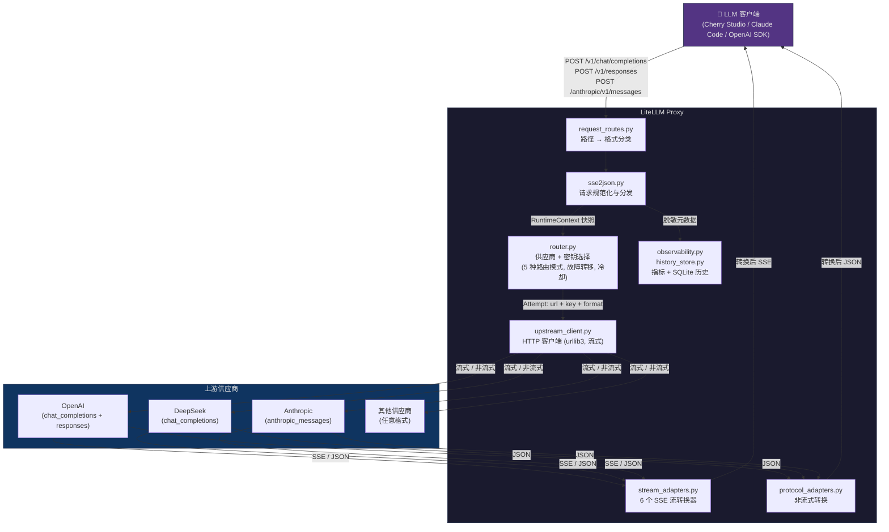
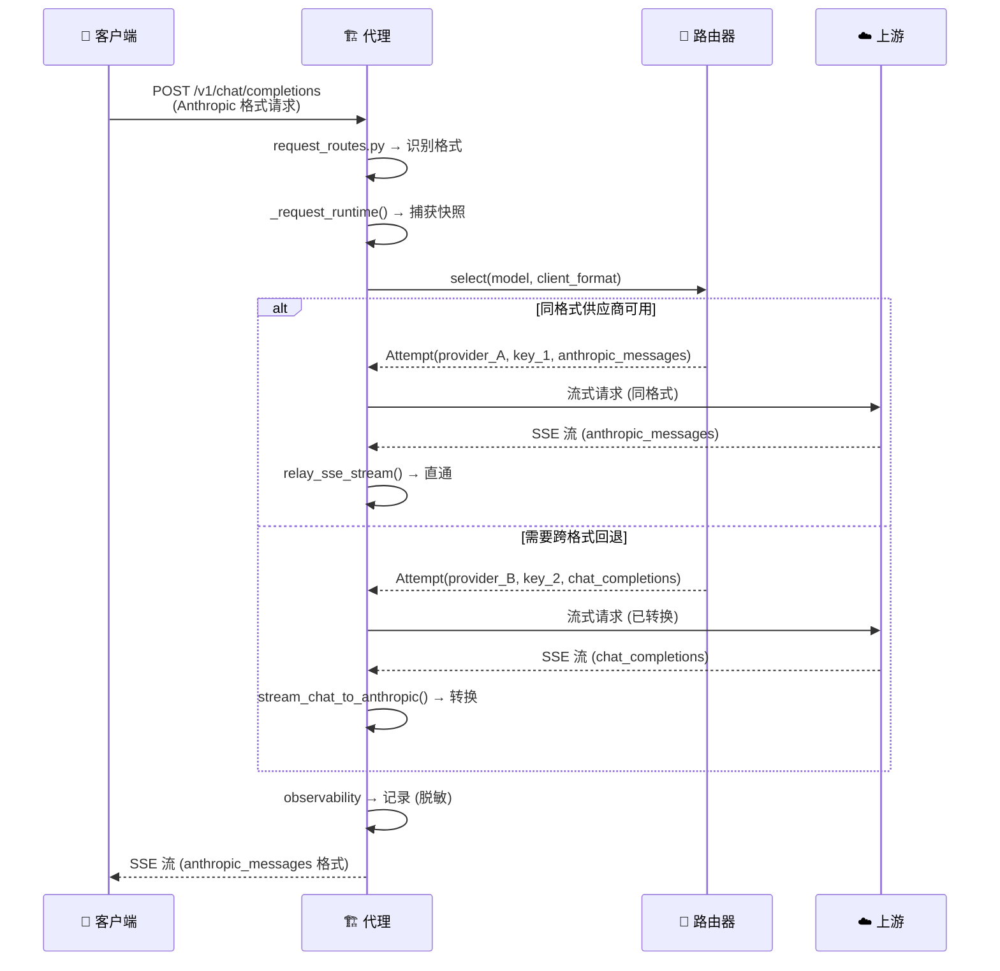

<div align="center">

# 🚀 LiteLLM Proxy

### 格式感知的 LLM API 代理 · 智能路由 · Web 控制台

[](https://opensource.org/licenses/MIT)
[](https://www.python.org/downloads/)
[](https://github.com/XD06/litellm-proxy/actions/workflows/ci.yml)
[](https://hub.docker.com/r/dsk3/litellm-proxy)
[](https://github.com/XD06/litellm-proxy/actions/workflows/ci.yml)
[](https://github.com/XD06/litellm-proxy/pulls)

[]()
[]()
[]()
[](https://github.com/XD06/litellm-proxy)
[](https://github.com/XD06/litellm-proxy)

[English](README.md) · **中文** · [架构文档](PROJECT_OVERVIEW.md) · [贡献指南](CONTRIBUTING.md)

</div>

---

> 一个基于 Python 的 **格式感知 LLM API 代理**，位于 LLM 客户端（Cherry Studio、Claude Code、OpenAI SDK 等）和多个上游 LLM 供应商之间。它接受三种 API 格式 — **OpenAI Chat Completions**、**OpenAI Responses** 和 **Anthropic Messages** — 并可在最佳可用供应商使用不同格式时进行任意两种格式之间的转换。

<table>
  <tr>
    <td width="50%" align="center"></td>
    <td width="50%" align="center"></td>
  </tr>
  <tr>
    <td width="50%" align="center"></td>
    <td width="50%" align="center"></td>
  </tr>
</table>

---

## 📑 目录

- [✨ 核心功能](#-核心功能)
- [⚡ 快速开始](#-快速开始)
- [🐳 Docker / VPS](#-docker--vps)
- [📊 控制台](#-控制台)
- [🏗️ 架构](#-架构)
- [🔌 客户端端点](#-客户端端点)
- [⚙️ 配置](#-配置)
- [🗺️ 项目结构](#-项目结构)
- [🛠️ 开发](#-开发)
- [🔒 安全](#-安全)
- [🤝 贡献](#-贡献)
- [📄 许可证](#-许可证)

---

## ✨ 核心功能

| 图标 | 功能 | 说明 |
|:---:|---|---|
| 🔄 | **三格式互转** | `chat_completions` ↔ `responses` ↔ `anthropic_messages` 双向转换，支持流式 SSE（文本、推理/思考块、工具调用） |
| 🧠 | **智能路由** | 5 种路由模式：优先级故障转移、轮询、加权轮询、随机选择，以及基于健康分数实时调整优先级的 **auto 模式** |
| 🛡️ | **故障转移与冷却** | Per-key 和 per-provider 冷却、重试策略、候选去重 — 天生具备弹性 |
| 📈 | **可观测性** | SQLite 持久化历史、逐次尝试延迟归因、路由可解释性、Token/费用估算 |
| 🖥️ | **Web 控制台** | 供应商健康卡片（延迟图表）、请求追踪、路由配置、模型映射、内置 Playground、审计日志 |
| ⚡ | **运行时配置** | 三层覆盖（`config.json → runtime_config.json → 环境变量`），Tombstone 删除机制；所有变更通过 `RLock` 序列化 |
| 🔒 | **并发安全** | `RuntimeContext` 快照确保热交换期间状态一致；流式适配器优雅处理客户端断连 |
| 🐳 | **Docker 就绪** | 一键 `docker compose up`，健康检查，多架构（amd64 + arm64），Nginx/Caddy 指南 |
| 🔐 | **安全优先** | 密钥始终脱敏；`hmac.compare_digest` 管理员认证；登录后自动从 URL 移除 `admin_key` |

---

## ⚡ 快速开始

### 🌱 零配置（环境变量）

无需配置文件 — 只需设置 API 密钥环境变量：

```bash
export OPENAI_API_KEY=sk-...
export DEEPSEEK_API_KEY=sk-...
python sse2json.py
# 代理自动从环境变量检测供应商并立即启动
```

### 📦 通过 pip 安装（PyPI）

```bash
pip install litellm-proxy
litellm-proxy                              # 使用自动配置启动
litellm-proxy --init                       # 从模板创建 config.json
litellm-proxy --config my.json --port 8080 # 自定义配置和端口
```

### 🔧 从源码运行

<details>
<summary><b>Windows</b></summary>

```powershell
copy config.example.jsonc config.json
# 编辑 config.json，填入 providers.*.keys
python sse2json.py
```
</details>

<details>
<summary><b>Linux / macOS</b></summary>

```bash
cp config.example.jsonc config.json
# 编辑 config.json，填入 providers.*.keys
python3 -m venv .venv
. .venv/bin/activate
pip install -r requirements.txt
python sse2json.py
```
</details>

### 📍 默认地址

| 地址 | 说明 |
| --- | --- |
| `http://127.0.0.1:4894` | 🖥️ 控制台 |
| `http://127.0.0.1:4894/v1/chat/completions` | 💬 Chat Completions 端点 |
| `http://127.0.0.1:4894/v1/responses` | 📨 OpenAI Responses 端点 |
| `http://127.0.0.1:4894/anthropic/v1/messages` | 🤖 Anthropic Messages 端点 |
| `http://127.0.0.1:4894/health` | ❤️ 健康检查 |
| `http://127.0.0.1:4894/v1/models` | 📋 模型列表 |

> 使用 `config.json` 中的 `server.admin_key` 登录控制台。

---

## 🐳 Docker / VPS

### 从 Docker Hub 拉取

```bash
docker pull dsk3/litellm-proxy:latest

docker run -d --name litellm-proxy \
  -p 4894:4894 \
  -v ./config.json:/app/config.json:ro \
  -v ./runtime_config.json:/app/runtime_config.json \
  -v ./tmp:/app/tmp \
  -v ./proxy_logs:/app/proxy_logs \
  -v ./data:/app/data \
  dsk3/litellm-proxy:latest
```

### 从源码构建

```bash
git clone https://github.com/XD06/litellm-proxy.git
cd litellm-proxy

mkdir -p tmp proxy_logs data
touch runtime_config.json
docker compose up -d --build
docker compose logs -f
```

### 健康检查

```bash
curl http://127.0.0.1:4894/health
curl http://127.0.0.1:4894/v1/models
```

> `docker-compose.yml` 默认绑定 `127.0.0.1:4894`。使用 Nginx/Caddy 反向代理实现 HTTPS。
>
> 完整迁移说明：[docs/VPS_MIGRATION.md](docs/VPS_MIGRATION.md)

---

## 📊 控制台

控制台是代理内置的静态 HTML/CSS/JS 页面：

| 功能 | 说明 |
| --- | --- |
| 🏥 **供应商健康** | 实时健康卡片，延迟图表和冷却状态 |
| 🔧 **供应商管理** | 添加/编辑供应商、密钥、代理设置、上游格式 |
| 🧭 **路由配置** | 编辑路由模式、重试策略、失败策略、模型路由 |
| 📋 **请求历史** | 逐次尝试追踪、延迟分解、Token 用量、费用估算 |
| 🎮 **Playground** | 内置 API 测试器，支持三种格式 |
| 📦 **运行时覆盖** | 导出、验证或清除运行时覆盖配置 |
| 📝 **审计日志** | 管理员操作记录，敏感字段自动脱敏 |

> 所有控制台写入都保存到 `runtime_config.json` — `config.json` **永远不会**被修改。

---

## 🏗️ 架构

### 系统概览



### 请求流程



### 关键设计决策

| 决策 | 理由 |
| --- | --- |
| **RuntimeContext 快照** | 一个不可变绑定（`config` + `router` + `upstream_client` + `observability` + `audit`）在配置重载时原子性交换。请求线程只需捕获一次即可看到一致的视图。 |
| **RLock 序列化 overlay** | 所有配置变更通过 `_locked_overlay()` 在可重入锁下完成 深拷贝 → 修改 → 修剪 → 持久化 → 交换，防止并发写入丢失。 |
| **Tombstone 删除机制** | Overlay 存储以 `null` 墓碑标记"删除"基础配置项。当基础配置项也被移除时，墓碑会被自动修剪，防止配置复活。 |
| **同格式直通** | 当客户端格式等于上游格式时，代理跳过 JSON 转换，直接转发原始字节（流式）或校验后转发（非流式），最大化吞吐。 |
| **仅响应头前重试** | 透明重试仅在向客户端发送任何字节之前发生。一旦 SSE 响应头写出，流即提交，中断会生成优雅的错误事件。 |
| **线程-per-请求** | Python 的 `ThreadingMixIn` 为每个请求分配独立线程。流式连接在整期间占用该线程。 |

### 路由模式

| 模式 | 行为 |
| --- | --- |
| `priority_failover` | 按优先级排序供应商，出错时故障转移 **（默认）** |
| `round_robin` | 均匀轮询供应商 |
| `weighted_rr` | 按权重轮询 |
| `random` | 每次请求随机排序 |
| `auto` | 基于健康分数动态调整优先级（每 15 秒） |

---

## 🔌 客户端端点

| 端点 | 客户端格式 |
| --- | --- |
| `POST /v1/chat/completions` | OpenAI Chat Completions |
| `POST /v1/responses` | OpenAI Responses |
| `POST /openai/v1/responses` | OpenAI Responses 别名 |
| `POST /anthropic/v1/messages` | Anthropic Messages |
| `POST /anthropic/v1/messages/count_tokens` | Anthropic Token 估算 |
| `POST /v1/messages` | 旧版 Anthropic 别名 |
| `GET /v1/models` | 模型列表 |
| `GET /health` | 健康检查 |
| `GET /` 或 `GET /-/dashboard` | Web 控制台 |

> 管理端点位于 `/-/admin/*`，需要通过 `X-Admin-Key` 头或 `Authorization: Bearer` 头提供管理员密钥。认证使用 `hmac.compare_digest` 进行时序安全比较。查询参数 `?admin_key=` 默认关闭（因可能泄露到代理日志和浏览器历史），如需启用请设置 `server.allow_query_admin_key=true`。

---

## ⚙️ 配置

### 配置文件

| 文件 | 用途 | 提交? |
| --- | --- | --- |
| `config.example.jsonc` | 带注释的参考配置（中文注释） | ✅ 是 |
| `config.example.json` | 最小 JSON 示例 | ✅ 是 |
| `config.json` | 真实基础配置（含密钥） | ❌ 否 |
| `runtime_config.json` | 控制台/Admin API 运行时覆盖 | ❌ 否 |

> **配置优先级：** `config.json → runtime_config.json → 环境变量`

<details>
<summary><b>🌍 环境变量</b></summary>

| 变量 | 作用 |
| --- | --- |
| `PROXY_CONFIG_PATH` | 基础配置路径 |
| `PROXY_RUNTIME_CONFIG_PATH` | 运行时覆盖路径 |
| `PROXY_PORT` | 覆盖 `server.port` |
| `PROXY_MAX_WORKERS` | 覆盖 `server.max_workers` |
| `PROXY_LOG_DIR` | 覆盖日志目录 |
| `PROXY_ADMIN_KEY` | 覆盖管理员密钥 |
| `PROXY_PROVIDER_KEYS__name` | 覆盖供应商密钥（JSON 数组） |
| `OPENAI_API_KEY` | 自动检测的供应商密钥（零配置模式） |
| `DEEPSEEK_API_KEY` | 自动检测的供应商密钥（零配置模式） |

</details>

<details>
<summary><b>📋 供应商配置示例</b></summary>

```jsonc
{
  "providers": {
    "deepseek": {
      "base_url": "https://api.deepseek.com",
      "formats": {
        "chat_completions": { "enabled": true, "path": "/v1/chat/completions" },
        "responses": { "enabled": false, "path": "/v1/responses" },
        "anthropic_messages": { "enabled": false, "path": "/v1/messages" }
      },
      "keys": [
        "sk-your-key",
        { "key": "sk-another-key", "proxy": "http://127.0.0.1:9000" }
      ],
      "enabled": true,
      "priority": 90
    }
  }
}
```

代理优先级：`密钥代理 → 供应商代理 → 全局代理 → 直连`

</details>

> 完整配置参考请见 [config.example.jsonc](config.example.jsonc)。

---

## 🗺️ 项目结构

| 领域 | 文件 | 说明 |
| --- | --- | --- |
| 🌐 HTTP 服务与分发 | `sse2json.py`, `request_routes.py`, `request_dispatcher.py` | 线程化 HTTP 服务器、路径分类、请求处理 |
| 🔑 Admin API | `admin_routes.py`, `config_manager.py` | 认证管理端点、`RLock` 序列化的运行时覆盖 |
| 🧭 路由与重试 | `router.py`, `scheduler_policy.py`, `model_registry.py` | 供应商/密钥选择、冷却、故障转移、健康分数、模型发现 |
| ☁️ 上游 HTTP | `upstream_client.py` | 基于 urllib3 的 HTTP 客户端，支持流式和超时管理 |
| 🔄 非流式转换 | `format_adapters.py`, `protocol_adapters.py`, `chat.py`, `responses.py` | 双向请求/响应格式转换 |
| 📡 流式转换 | `stream_adapters.py` | 6 个 SSE 流适配器 + `relay_sse_stream` 直通 + `BufferedSSEWriter` |
| 📈 可观测性 | `observability.py`, `history_store.py`, `audit_store.py`, `routing_explain.py`, `usage_accounting.py` | SQLite 历史、指标、审计日志、费用估算 |
| 🖥️ 控制台运行时 | `dashboard/` | 构建后的静态资源，由代理服务 |
| 🎨 控制台源码 | `dashboard_src/` | Vite + 原生 JS 源码，含 i18n、morphdom |
| 🐳 部署 | `Dockerfile`, `docker-compose.yml`, `deploy/` | Docker、systemd、Nginx 反向代理配置 |
| 🧪 测试 | `tests/`（28 个文件，459+ 测试） | 覆盖路由、转换、配置、流式、Admin API 的 pytest |

> **深入架构说明请见 [PROJECT_OVERVIEW.md](PROJECT_OVERVIEW.md)。**

---

## 🛠️ 开发

```bash
# 运行测试（459+ 测试）
python -m pytest tests/ -q

# 编译检查核心文件
python -m py_compile sse2json.py config_loader.py config_manager.py router.py \
  upstream_client.py stream_adapters.py

# 检查控制台打包语法
node --check dashboard/app.js

# 从源码构建控制台
cd dashboard_src && npm install && npm run build

# 启动控制台开发服务器（带 HMR）
cd dashboard_src && npm run dev
```

### CI/CD

| 工作流 | 文件 | 触发条件 | 功能 |
| --- | --- | --- | --- |
| **CI** | `.github/workflows/ci.yml` | push/PR 到 `main` | Python 3.10–3.13 矩阵测试、编译检查、控制台语法检查、Docker 构建 + 冒烟测试 |
| **Docker 发布** | `.github/workflows/docker-publish.yml` | push 到 `main`，标签 `v*` | 多架构构建（amd64 + arm64）、推送到 Docker Hub、最新版冒烟测试 |

---

## 🔒 安全

- 🔑 暴露服务前替换示例 `server.admin_key`
- 🌐 VPS 部署优先使用 HTTPS 反向代理
- 🔒 端口 `4894` 默认绑定 localhost
- 🚫 永远不要提交 `config.json`、`runtime_config.json`、日志或 SQLite 数据
- 🎭 Admin API 响应和历史记录始终对密钥脱敏
- 🧹 登录成功后通过 `history.replaceState` 自动从 URL 中移除 `admin_key`
- ⏱️ 管理员认证使用 `hmac.compare_digest`（时序安全）

---

## 🤝 贡献

欢迎贡献！参见 [CONTRIBUTING.md](CONTRIBUTING.md) 了解开发环境、代码规范和 PR 流程。

---

## 📄 许可证

[MIT](LICENSE) © 2026 [XD06](https://github.com/XD06)
