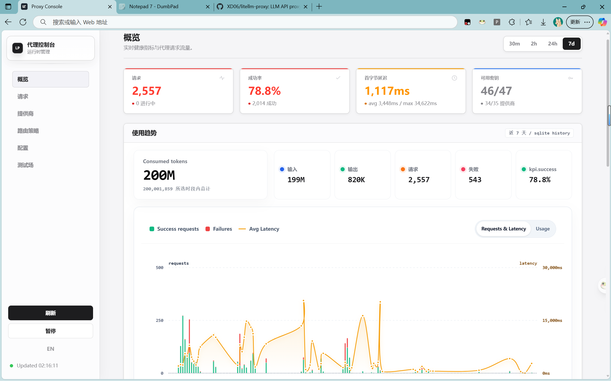
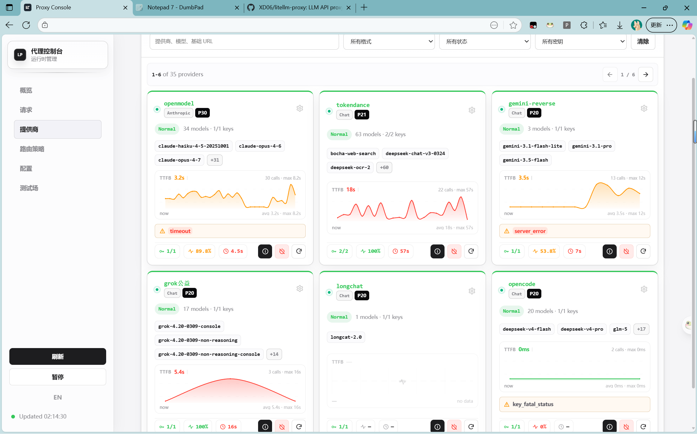
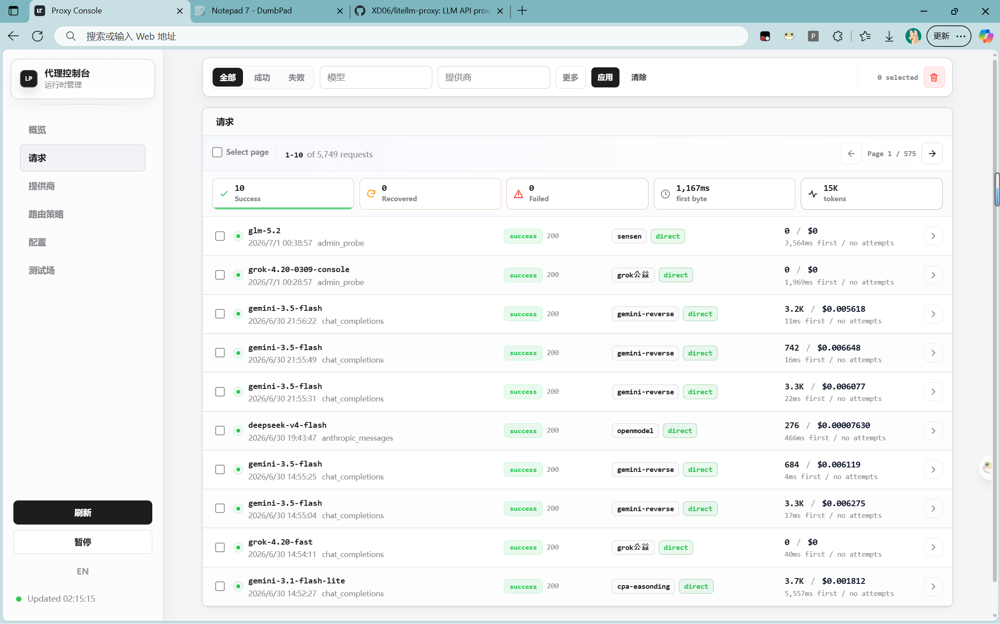
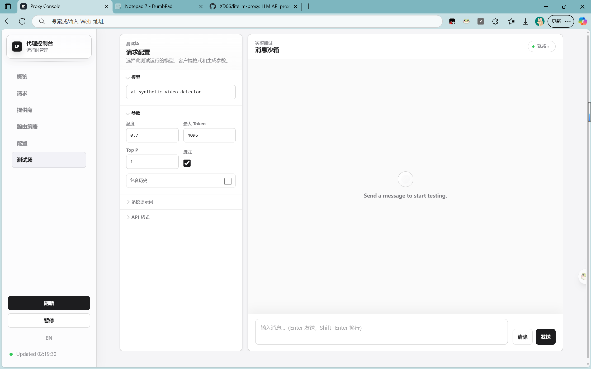

# LLM API 代理 — 三格式互转 · 智能路由 · Web 控制台

[](https://opensource.org/licenses/MIT) [](https://www.python.org/downloads/) [](#开发) [](#docker--vps-1) [](https://github.com/XD06/litellm-proxy/pulls)

[English](README.md) | **中文**

<table>
  <tr>
    <td width="50%" align="center"></td>
    <td width="50%" align="center"></td>
  </tr>
  <tr>
    <td width="50%" align="center"></td>
    <td width="50%" align="center"></td>
  </tr>
</table>

一个格式感知的 LLM API 代理，接受 OpenAI Chat Completions、OpenAI Responses 和 Anthropic Messages 三种格式的请求，在多个供应商和密钥之间智能路由并自动故障转移，必要时在不同格式之间进行转换——全部通过内置 Web 控制台管理。

客户端通过路径选择 API 格式，每个供应商声明其上游格式。代理优先使用同格式直通以提升速度，仅在回退供应商使用不同格式时才进行转换。

---

## 核心功能

- **三格式互转** — `chat_completions` ↔ `responses` ↔ `anthropic_messages` 双向转换，支持流式 SSE（文本、推理/思考块、工具调用）
- **智能路由** — 优先级故障转移、轮询、加权轮询、随机选择，支持 per-key/per-provider 冷却、重试策略、候选去重
- **Web 控制台** — 供应商健康卡片（延迟图表）、请求历史（逐次尝试追踪）、路由配置、失败策略、模型映射、审计日志
- **可观测性** — SQLite 持久化历史、逐次尝试延迟归因、路由可解释性、Token/费用估算、密钥脱敏
- **运行时配置** — 三层覆盖（`config.json → runtime_config.json → 环境变量`），Tombstone 删除机制防止基础配置复活
- **Docker 就绪** — 一键 `docker compose up`，支持 Nginx/Caddy 反向代理
- **安全优先** — 密钥在 API 响应和历史记录中始终脱敏；管理端点需要认证；配置文件不提交到 git

## 快速开始

### Windows

```powershell
copy config.example.jsonc config.json
# 编辑 config.json，填入 providers.*.keys
python sse2json.py
```

### Linux / macOS

```bash
cp config.example.jsonc config.json
# 编辑 config.json，填入 providers.*.keys
python3 -m venv .venv
. .venv/bin/activate
pip install -r requirements.txt
python sse2json.py
```

### 默认地址

| 地址 | 说明 |
| --- | --- |
| `http://127.0.0.1:4894` | 控制台 |
| `http://127.0.0.1:4894/v1/chat/completions` | Chat Completions 端点 |
| `http://127.0.0.1:4894/anthropic/v1/messages` | Anthropic Messages 端点 |
| `http://127.0.0.1:4894/health` | 健康检查 |

使用 `config.json` 中的 `server.admin_key` 登录控制台。

## Docker / VPS

```bash
git clone https://github.com/XD06/litellm-proxy.git
cd litellm-proxy

# 复制配置文件：
#   config.json
#   runtime_config.json  (可选)

mkdir -p tmp proxy_logs data
touch runtime_config.json
docker compose up -d --build
docker compose logs -f
```

健康检查：

```bash
curl http://127.0.0.1:4894/health
curl http://127.0.0.1:4894/v1/models
```

`docker-compose.yml` 默认绑定 `127.0.0.1:4894`。使用 Nginx/Caddy 反向代理实现 HTTPS。

完整迁移说明：[docs/VPS_MIGRATION.md](docs/VPS_MIGRATION.md)

## 控制台

控制台是代理内置的静态 HTML/CSS/JS 页面，功能包括：

- 查看供应商/密钥健康状态和冷却状态
- 添加或编辑供应商、密钥、代理设置、上游格式
- 从上游刷新模型能力
- 编辑路由、重试、失败策略和模型路由设置
- 查看最近请求的逐次尝试追踪、延迟、Token 用量和费用
- 导出、验证或清除运行时覆盖配置
- 查看管理员操作审计记录

所有控制台写入都保存到 `runtime_config.json` — `config.json` 永远不会被修改。

## 路由模型

```text
HTTP 请求
  → request_routes.py 识别客户端格式
  → sse2json.py 规范化请求并解析模型
  → router.py 选择供应商 + 密钥 + 上游格式
  → 同格式直通或格式转换
  → upstream_client.py 调用供应商
  → stream_adapters.py / protocol_adapters.py 转换响应（如需要）
  → observability/history 记录脱敏元数据
```

| 模式 | 行为 |
| --- | --- |
| `priority_failover` | 按优先级排序供应商，出错时故障转移 |
| `round_robin` | 均匀轮询供应商 |
| `weighted_rr` | 按权重轮询 |
| `random` | 每次请求随机排序 |

## 客户端端点

| 端点 | 客户端格式 |
| --- | --- |
| `POST /v1/chat/completions` | OpenAI Chat Completions |
| `POST /v1/responses` | OpenAI Responses |
| `POST /openai/v1/responses` | OpenAI Responses 别名 |
| `POST /anthropic/v1/messages` | Anthropic Messages |
| `POST /anthropic/v1/messages/count_tokens` | Anthropic Token 估算 |
| `POST /v1/messages` | 旧版 Anthropic 别名 |
| `GET /v1/models` | 模型列表 |
| `GET /health` | 健康检查 |
| `GET /` 或 `GET /-/dashboard` | Web 控制台 |

管理端点位于 `/-/admin/*`，需要通过 `X-Admin-Key`、`Authorization: Bearer` 或 `?admin_key=` 提供管理员密钥。

## 配置

| 文件 | 用途 | 提交? |
| --- | --- | --- |
| `config.example.jsonc` | 带注释的参考配置 | 是 |
| `config.example.json` | 最小 JSON 示例 | 是 |
| `config.json` | 真实基础配置（含密钥） | 否 |
| `runtime_config.json` | 控制台/Admin API 运行时覆盖 | 否 |

**配置优先级：** `config.json → runtime_config.json → 环境变量`

<details>
<summary>环境变量</summary>

| 变量 | 作用 |
| --- | --- |
| `PROXY_CONFIG_PATH` | 基础配置路径 |
| `PROXY_RUNTIME_CONFIG_PATH` | 运行时覆盖路径 |
| `PROXY_PORT` | 覆盖 `server.port` |
| `PROXY_MAX_WORKERS` | 覆盖 `server.max_workers` |
| `PROXY_LOG_DIR` | 覆盖日志目录 |
| `PROXY_ADMIN_KEY` | 覆盖管理员密钥 |
| `PROXY_PROVIDER_KEYS__name` | 覆盖供应商密钥（JSON 数组） |

</details>

<details>
<summary>供应商配置示例</summary>

```jsonc
{
  "providers": {
    "deepseek": {
      "base_url": "https://api.deepseek.com",
      "formats": {
        "chat_completions": { "enabled": true, "path": "/v1/chat/completions" },
        "responses": { "enabled": false, "path": "/v1/responses" },
        "anthropic_messages": { "enabled": false, "path": "/v1/messages" }
      },
      "keys": [
        "sk-your-key",
        { "key": "sk-another-key", "proxy": "http://127.0.0.1:9000" }
      ],
      "enabled": true,
      "priority": 90
    }
  }
}
```

代理优先级：`密钥代理 → 供应商代理 → 全局代理 → 直连`

</details>

## 项目结构

| 领域 | 文件 |
| --- | --- |
| HTTP 服务与分发 | `sse2json.py`, `request_routes.py` |
| Admin API | `admin_routes.py`, `config_manager.py` |
| 路由与重试策略 | `router.py`, `scheduler_policy.py`, `model_registry.py` |
| 上游 HTTP | `upstream_client.py` |
| 非流式转换 | `format_adapters.py`, `protocol_adapters.py`, `chat.py`, `responses.py` |
| 流式转换 | `stream_adapters.py` |
| 可观测性与历史 | `observability.py`, `history_store.py`, `audit_store.py`, `routing_explain.py` |
| 控制台运行时 | `dashboard/` |
| 控制台源码 | `dashboard_src/` |
| 部署 | `Dockerfile`, `docker-compose.yml`, `deploy/` |

更多架构上下文：[PROJECT_OVERVIEW.md](PROJECT_OVERVIEW.md)

## 开发

```bash
# 运行测试
python -m pytest tests/ -q

# 编译检查核心文件
python -m py_compile sse2json.py config_loader.py config_manager.py router.py upstream_client.py stream_adapters.py

# 检查控制台打包语法
node --check dashboard/app.js

# 从源码构建控制台
cd dashboard_src && npm install && npm run build
```

## 安全须知

- 暴露服务前替换示例 `server.admin_key`
- VPS 部署优先使用 HTTPS 反向代理
- 端口 `4894` 默认绑定 localhost
- 永远不要提交 `config.json`、`runtime_config.json`、日志或 SQLite 数据
- Admin API 响应和历史记录始终对密钥脱敏

## 许可证

[MIT](LICENSE) © 2026 [XD06](https://github.com/XD06)
