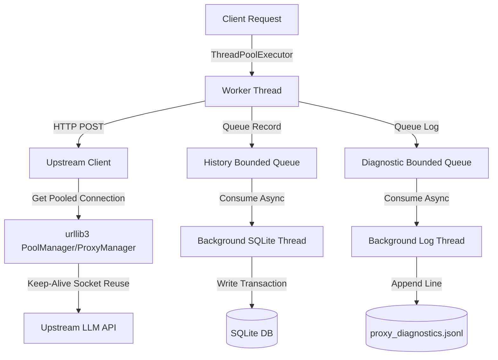

# Technical Specification: Extreme Performance & Concurrency Hardening

**Date:** 2026-06-13  
**Status:** Draft / Pending Review  
**Target Project:** `C:\Users\dsk\Desktop\litellm-proxy`  
**Goal:** Optimize the proxy to achieve extreme performance, easily handle 5-10+ concurrent requests without blocking, eliminate handshake latency to upstream providers, and remove disk I/O bottlenecks from the main request threads.

---

## 1. Problem Statement & Codebase Context

Under high concurrency, the proxy experiences latency overheads due to two primary synchronous bottlenecks:
1. **Upstream TCP/TLS Handshake Overhead:** 
   - **File:** [upstream_client.py](file:///C:/Users/dsk/Desktop/litellm-proxy/upstream_client.py) (Lines 28, 32-52, 65-128)
   - **Issue:** Currently utilizes Python's standard `urllib.request` library. Every non-streaming request or stream opening creates a new connection (even though proxy openers are cached, `urllib.request.build_opener` does not support connection pooling/Keep-Alive reuse). This results in a full TCP + TLS handshake (50ms - 200ms latency penalty) for *every* upstream completion call.
2. **Synchronous SQLite History Writes:**
   - **File:** [history_store.py](file:///C:/Users/dsk/Desktop/litellm-proxy/history_store.py) (Lines 182-192) and [observability.py](file:///C:/Users/dsk/Desktop/litellm-proxy/observability.py) (Line 363)
   - **Issue:** `record_request()` executes blockingly on the request-handling thread. It establishes a connection to SQLite, runs write queries, prunes old data, and commits. High concurrent write locks on SQLite database files will cause request worker threads to block.
3. **Synchronous Diagnostic Log Disk Writes:**
   - **File:** [sse2json.py](file:///C:/Users/dsk/Desktop/litellm-proxy/sse2json.py) (Lines 895-903)
   - **Issue:** `_upstream_error_diagnostics()` performs blocking file open/write operations under a global lock `DIAGNOSTIC_LOG_LOCK` in the request worker thread, creating thread contention during error storms.

---

## 2. Proposed Design & Architecture



---

## 3. Detailed Component Specs

### 3.1. Connection Pooling with `urllib3`
Instead of rebuilding openers, we will use a thread-safe connection pool manager using the `urllib3` library.

#### 3.1.1. Pool Manager Management
In `OpenAIUpstreamClient` ([upstream_client.py](file:///C:/Users/dsk/Desktop/litellm-proxy/upstream_client.py)):
- Remove `self._default_opener` and `self._proxy_openers` (Lines 28, 29).
- Initialize `self._pool_managers: Dict[str, urllib3.PoolManager | urllib3.ProxyManager] = {}` and `self._pool_managers_lock = threading.Lock()`.
- Implement `_pool_manager_for(self, proxy_url: Optional[str] = None)`:
  - Dynamically read `server.max_workers` from config (default `20`).
  - Calculate `pool_size = max(10, max_workers)`.
  - Cache `urllib3.PoolManager(num_pools=pool_size, maxsize=pool_size, retries=False)` for direct connections.
  - Cache `urllib3.ProxyManager(proxy_url, num_pools=pool_size, maxsize=pool_size, retries=False)` for proxy-routed connections.

#### 3.1.2. Response Streaming Line Wrapper & compatibility
To feed responses cleanly into [stream_adapters.py](file:///C:/Users/dsk/Desktop/litellm-proxy/stream_adapters.py) without modifications to its read-loop and socket timeout logic:
- Wrap `urllib3`'s streaming response in an `HTTPResponseLineWrapper`:
  ```python
  class HTTPResponseLineWrapper:
      def __init__(self, resp):
          self.resp = resp
          self.reader = io.BufferedReader(resp)

      def readline(self, *args, **kwargs):
          return self.reader.readline(*args, **kwargs)

      def __iter__(self):
          return self

      def __next__(self):
          line = self.readline()
          if not line:
              raise StopIteration
          return line

      def close(self):
          self.reader.close()
          self.resp.close()

      @property
      def fp(self):
          # Mock the standard library urllib response structure to keep stream_adapters.py 100% compatible
          try:
              sock = self.resp.connection.sock if (self.resp and self.resp.connection) else None
              if sock:
                  return MockFp(sock)
          except Exception:
              pass
          return None
  ```
  This wrapper satisfies the exact interface consumed by `stream_adapters.py` (lines 62, 82, 98, and nested socket query `fp.raw._sock`).

#### 3.1.3. urllib-compatible Error Raising
Since `urllib3` does not automatically raise exceptions on HTTP `>= 400` status codes, the client wrapper methods (`request_json_with_timing`, `open_stream`, `fetch_models`) must manually construct and raise `urllib.error.HTTPError`:
```python
if resp.status >= 400:
    import io
    from urllib.error import HTTPError
    # Read the error body and wrap it in BytesIO
    fp = io.BytesIO(resp.data if hasattr(resp, "data") else resp.read())
    raise HTTPError(url, resp.status, resp.reason, resp.headers, fp)
```

---

### 3.2. Asynchronous History Store Writes
In `RequestHistoryStore` ([history_store.py](file:///C:/Users/dsk/Desktop/litellm-proxy/history_store.py)):

1. **Queue Setup:**
   - In `__init__`, initialize `self._queue = queue.Queue(maxsize=1000)` and `self._writer_running = False`.
2. **Background Thread:**
   - In `initialize()`, spawn a daemon worker thread named `history-writer` running a continuous write loop:
     ```python
     def _write_loop(self) -> None:
         while self._writer_running:
             try:
                 item = self._queue.get(timeout=1.0)
             except queue.Empty:
                 continue
             if item is None: # Shutdown signal
                 self._queue.task_done()
                 break
             try:
                 self._ensure_ready()
                 with self._lock:
                     with self._connect() as conn:
                         self._insert_request(conn, item)
                         self._prune_locked(conn)
             except Exception:
                 pass
             finally:
                 self._queue.task_done()
     ```
3. **Non-blocking Write Submission:**
   - Modify `record_request()` to use non-blocking queue insertion:
     ```python
     def record_request(self, item: Dict[str, Any]) -> None:
         if not self.enabled:
             return
         if not self._writer_running:
             self.initialize()
         try:
             self._queue.put(item, block=False)
         except queue.Full:
             # Dropped safely under extreme concurrency overload to save latency
             pass
     ```
4. **Clean Clear/Draining:**
   - In `clear()`, drain the queue (using `.get_nowait()`) prior to running table deletion and database VACUUM.

---

### 3.3. Non-blocking Diagnostic Log Writes
In `sse2json.py` ([sse2json.py](file:///C:/Users/dsk/Desktop/litellm-proxy/sse2json.py)):

1. **Global Queue:**
   - Define `_DIAGNOSTIC_QUEUE = queue.Queue(maxsize=1000)` and thread handle `_DIAGNOSTIC_WRITER_THREAD = None`.
2. **Lazy Worker Loop:**
   - Implement `_diagnostic_write_loop()` to pull from queue and append logs to disk.
3. **Queue insertion:**
   - Re-route `_upstream_error_diagnostics` (or the lines writing to `_diagnostic_log_path`) to format the line and push to `_DIAGNOSTIC_QUEUE` with `block=False`.

---

## 4. Testing & Verification

1. **Unit Tests:**
   Ensure standard tests compile and run:
   ```powershell
   python -m py_compile sse2json.py stream_adapters.py upstream_client.py observability.py history_store.py
   python -m unittest discover -s tests
   ```
2. **Stream Compatibility Test:**
   Execute real-stream validation matrix to guarantee that mock `fp` and line wrapper yield exactly correct event stream shapes:
   ```powershell
   python tools\real_stream_tool_smoke.py --run --base-url http://127.0.0.1:4894 --output tmp\real_stream_tool_smoke.json
   ```
